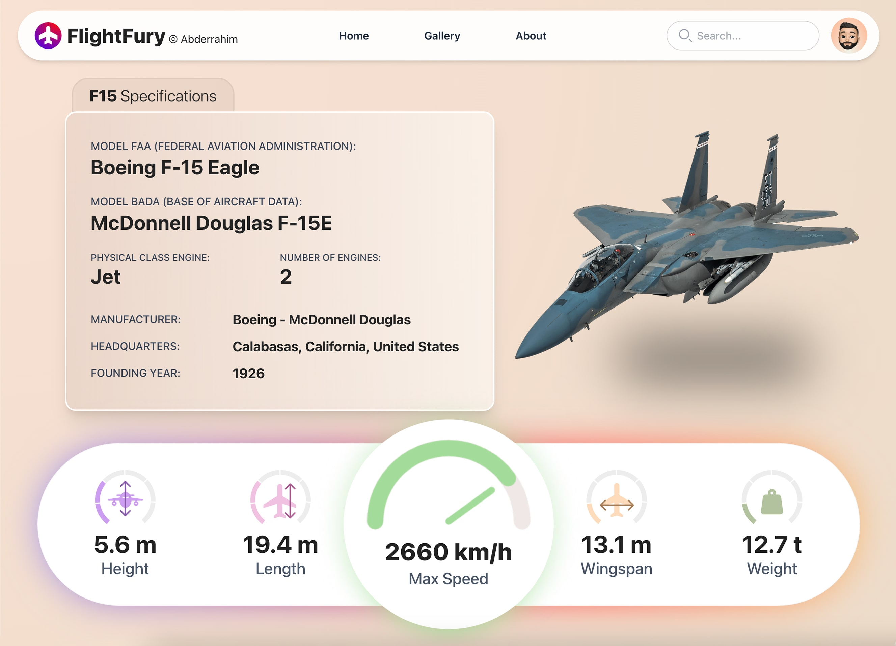
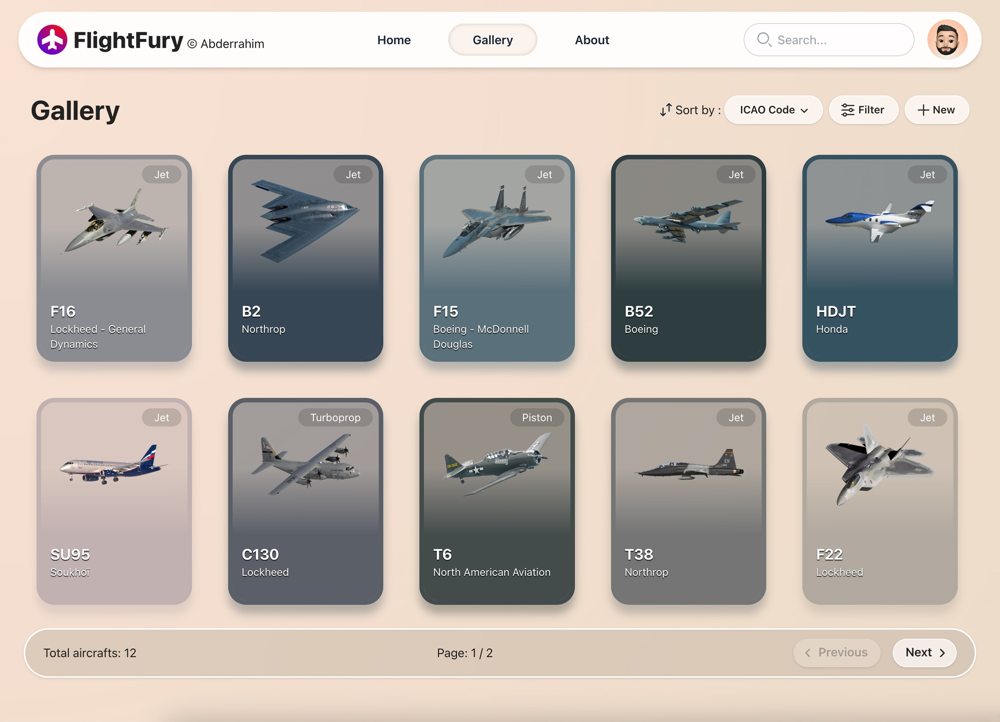

<p align="center">
    
</p>

## 📖 Overview

This is the back-end for an aviation application, built using the Spring Framework. It leverages Spring Cloud for microservices architecture, Spring Data JPA for relational database interactions, and Spring Data MongoDB for NoSQL data storage. The application provides robust APIs to manage aircrafts-related data, such as aircraft details, and manufacturers information.

The front-end project can be found [here](#)

## 📸 Screenshots

<p align="center">
    
    
</p>

## ✅ Features
- Microservices Architecture: Built with Spring Cloud for scalability and distributed system support.
- Relational Database Support: Uses Spring Data JPA for seamless interaction with relational databases.
- NoSQL Database Support: Integrates Spring Data MongoDB for flexible document-based data storage.
- RESTful APIs: Exposes endpoints for managing aircrafts data.
- Service Discovery: Utilizes Spring Cloud Eureka for service registration and discovery.

## ⚙️ Technologies Used

- Java 21
- Spring Boot 3.5.5
- Spring Cloud (Eureka & Gateway)
- Spring Data JPA
- Spring Data MongoDB
- MySQL & MongoDB databases
- JUnit 5
- Docker

## 📁 Project Structure

```bash
flightfury-backend/
├── app-screenshots/ # Application screenshots
├── flightfury-aircrafts/
│   └── src/
│       ├── main/
│       │   ├── java/dev/abderrahim/flightfuryaicrafts/
│       │   │   ├── controllers/    # REST controllers
│       │   │   ├── repositories/   # JPA repositories
│       │   │   ├── models/         # Entity classes
│       │   │   └── FlightFuryAircraftsApplication.java # Spring Boot main class
│       │   └── resources/
│       │       └── application.yml # Configuration file
│       └── test
│           └── FlightFuryAircraftsApplicationTest.java 
├── flightfury-manufacturers/
│   └── src/
│       ├── main/
│       │   ├── java/dev/abderrahim/flightfurymanufacturers/
│       │   │   ├── controllers/    # REST controllers
│       │   │   ├── repositories/   # MongoDB repositories
│       │   │   ├── models/         # Entity classes
│       │   │   └── FlightFuryManufacturersApplication.java # Spring Boot main class
│       │   └── resources/
│       │       └── application.yml # Configuration file
│       └── test
│           └── FlightFuryManufacturersApplicationTest.java 
├── flightfury-gateway/
│   └── src/
│       └── main/
│           ├── java/dev/abderrahim/flightfurygateway/
│           │   └── FlightFuryGatewayApplication.java # Spring Boot main class
│           └── resources/
│               └── application.yml # Configuration file
├── flightfury-service-discovery/
│   └── src/
│       └── main/
│           ├── java/dev/abderrahim/flightfuryservicediscovery/
│           │   └── FlightFuryDiscoveryApplication.java # Spring Boot main class
│           └── resources/
│               └── application.yml # Configuration file
├── pom.xml # Maven dependencies and metadata
├── Dockerfile # Docker configuration
└── README.md # This file
```
